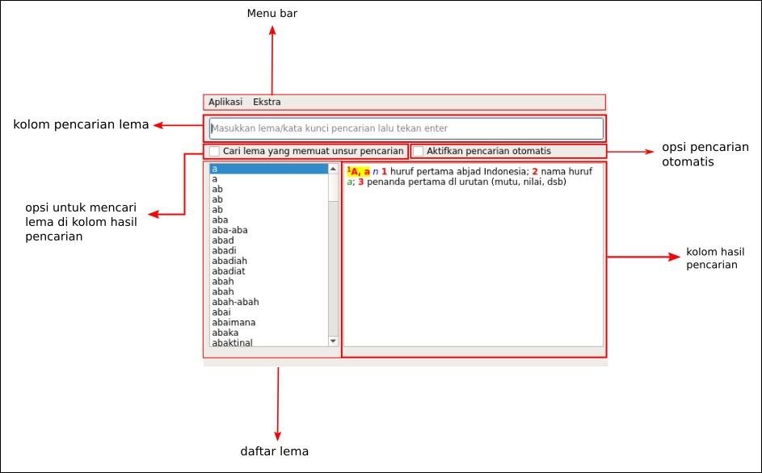
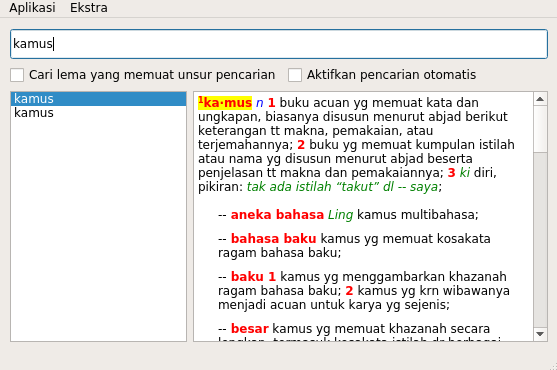
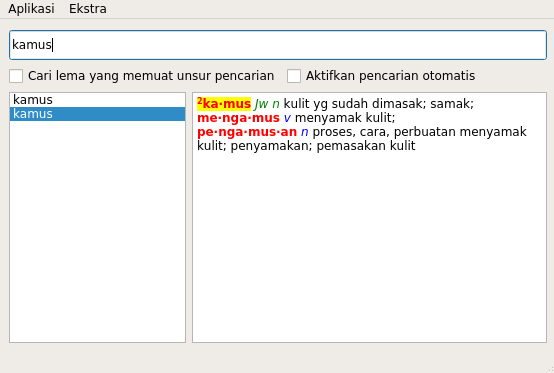
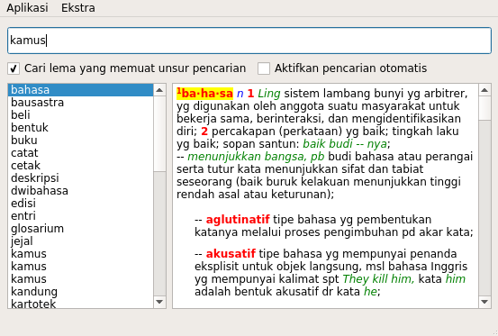
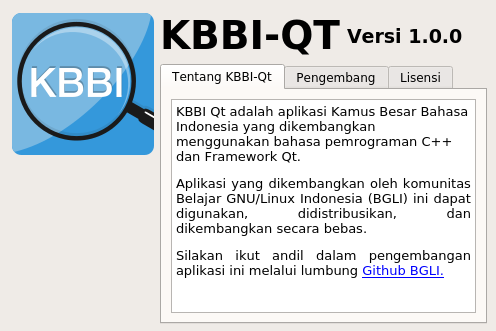
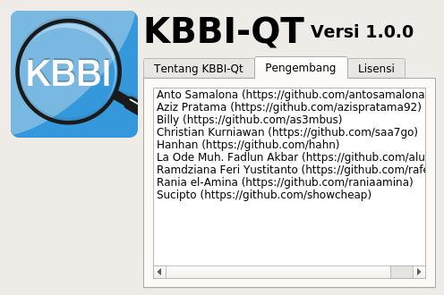

# 1. Pengenalan KBBI Qt
## 1.1 Apa itu KBBI Qt?
KBBI Qt adalah aplikasi Kamus Besar Bahasa Indonesia berbasis GUI (*Graphical User Interface* atau Antarmuka Berbasis Grafik) yang dikembangkan dengan bahasa pemrograman C++ dan Framework Qt.

Dirilis dengan lisensi GNU GPL v3.0, maka KBBI Qt adalah [*free software*][3], sehingga aplikasi yang dikembangkan oleh komunitas Belajar GNU/Linux Indonesia (BGLI) ini bebas dijalankan untuk tujuan apapun, digunakan, didistribusikan (baik berbayar atau gratis), disalin, dimodifikasi, dan dikembangkan.

## 1.2 Keuntungan menggunakan KBBI Qt
Badan Pengembangan dan Pembinaan Bahasa (Badan Bahasa) serta Kementerian Pendidikan dan Kebudayaan (Kemendikbud) sebenarnya telah merilis aplikasi KBBI berbasis web; [kbbi.web.id][0] (KBBI III), [kbbi4.portalbahasa.com][1] (KBBI IV), dan [kbbi.kemdikbud.go.id][2] (KBBI V). Namun, ketiganya memiliki kekurangan, yakni pengguna harus dalam keadaan daring untuk mengaksesnya.

KBBI Qt ingin memastikan bahwa pengguna dapat mengakses KBBI dalam keadaan luring melalui komputer atau laptop. Sebagai tambahan, KBBI Qt juga membawa PUEBI (Pedoman Umum Ejaan Bahasa Indonesia) yang bisa diakses melalui menu Ekstra pada *menu bar* (lihat poin 4.4).

# 2. Pemasangan KBBI Qt
Beberapa kontributor telah memaketkan aplikasi KBBI Qt untuk CentOS/RHEL7, Fedora, Arch Linux, Debian beserta turunannya, termasuk BlankOn (sebagai paket resmi), dan sistem operasi Windows.

Berikut cara instal KBBI Qt di distro-distro tersebut, termasuk cara instal dari *source code* (*compile* manual) dan cara instal di Windows.

## 2.1 CentOS/RHEL7
    $ sudo wget https://copr.fedorainfracloud.org/coprs/alunux/kbbi-qt-git/repo/epel-7/alunux-kbbi-qt-git-epel-7.repo -O /etc/yum.repos.d/kbbi-qt.repo
    $ sudo yum install KBBI-Qt

## 2.2 Fedora 23/24/25/Rawhide
    $ sudo dnf copr enable alunux/kbbi-qt-git
    $ sudo dnf install KBBI-Qt

## 2.3 Debian dan Distro Turunan Debian
Untuk 32-bit:

    $ wget https://github.com/bgli/kbbi-qt/releases/download/v1.0/kbbi-qt_1.0-1_i386.deb
    $ sudo dpkg -i kbbi-qt_1.0-1_i386.deb

Untuk 64-bit:

    $ wget https://github.com/bgli/kbbi-qt/releases/download/v1.0/kbbi-qt_1.0-1_amd64.deb
    $ sudo dpkg -i kbbi-qt_1.0-1_amd64.deb

## 2.4 BlankOn Linux
    $ sudo apt install kbbi-qt

## 2.5 Arch Linux
    $ yaourt -S kbbi-qt

atau

    $ git clone https://aur.archlinux.org/kbbi-qt.git
    $ cd kbbi-qt
    $ makepkg -si

## 2.6 Instal dari source code
Untuk melakukan kompilasi, pastikan sistem operasi Anda sudah memiliki **GCC dengan dukungan C++**, **Qt5**, dan **qmake (qtchooser)**.

    $ git clone https://github.com/bgli/kbbi-qt.git
    $ cd kbbi-qt
    $ qmake KBBI-Qt.pro
    $ make
    $ sudo make clean install

Untuk menghapus aplikasi:

    $ sudo make uninstall

## 2.7 Windows
Unduh dari https://github.com/bgli/kbbi-qt/releases/download/v1.0/kbbi-qt_1.0-1_win32.7z. Untuk menginstalnya, cukup ekstrak berkas **kbbi-qt\_1.0-1_win32..7z** lalu jalankan KBBI Qt dengan KBBI-Qt.exe.

# 3. Pengenalan antarmuka

# 4. Penggunaan KBBI Qt

## 4.1 Cari arti kata

Untuk mencari arti kata "kamus", ketikkan kata "kamus" dalam kolom pencarian, lalu tekan Enter pada *keyboard*. Centang opsi "**Aktifkan pencarian otomatis**" untuk mencari arti kata tanpa perlu menekan Enter.

Hasil pencarian akan muncul pada kolom kanan, lihat gambar di bawah ini.

Jika kata yang dicari mengandung lebih dari satu arti, kata akan muncul sebanyak arti kata tersebut. Lihat pada hasil pencarian arti kata "kamus" di poin 4.1, kata "kamus" memiliki dua arti, sehingga ia akan muncul dua kali. Untuk melihat arti lain dari kata "kamus", silakan klik kata "kamus" lainnya atau gunakan tombol panah (atas bawah) pada *keyboard*.

## 4.2 Cari arti atau kata yang mengandung lema

Centang pada "**Cari lema yang memuat unsur pencarian**" untuk menghasilkan daftar lema yang artinya memuat kata yang dicari.

Misal, kata "kamus" termuat dalam arti kata "bahasa", "bausastra", "beli", dll.

## 4.3 Perbesar fonta pada kolom hasil pencarian

Klik kolom hasil pencarian, tahan tombol *Ctrl* pada *keyboard*, lalu *scroll* menggunakan *mouse*.

## 4.4 Mengakses PUEBI

Klik "Ekstra" pada *menu bar*, lalu pilih PUEBI. PUEBI akan terbuka di peramban favorit Anda secara otomatis.

## 4.5 Keterangan aplikasi, nama-nama pengembang, dan lisensi

Untuk melihat penjelasan singkat seputar KBBI Qt, nama-nama pengembang, dan lisensi, klik "Aplikasi" pada *menu bar*, lalu pilih "Tentang".

**Tampilan dialog Tentang Aplikasi**:

**Tampilan dialog Pengembang Aplikasi**:

Anda bisa membuka akun GitHub pengembang melalui peramban dengan cara meng-klik dua kali pada nama pengembang.

**Tampilan dialog Lisensi Aplikasi**:

[0]: http://kbbi.web.id
[1]: http://kbbi4.portalbahasa.com
[2]: http://kbbi.kemdikbud.go.id/
[3]: https://www.gnu.org/philosophy/free-sw.en.html
